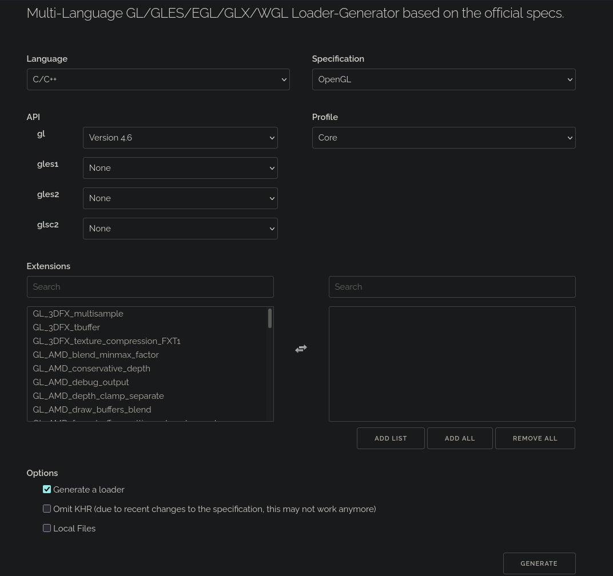

# threebody-simulation  

## Learning outcomes
- Practice development in C++
- Learn OpenGL
- Apply my mathematical background to learn some basic physics

The code is mostly to get down and dirty and some experience with C++ rather than trying to make this repository look "pretty".

## Dependencies

### C++
`sudo apt install libstdc++-12-dev`

### OpenGL
`sudo apt install cmake pkg-config mesa-utils libglu1-mesa-dev freeglut3-dev mesa-common-dev libglew-dev libglfw3-dev libglm-dev libao-dev libmpg123-dev`

### Wayland and X11
`sudo apt install libwayland-dev libxkbcommon-dev xorg-dev`

## OpenGL setup

### GLFW library
cd /usr/local/lib/
sudo git clone https://github.com/glfw/glfw.git
cd glfw
sudo cmake .
sudo make
sudo make install

### GLAD library
Access https://glad.dav1d.de/
Configure like the image below

Generate the zip file
Copy the directories inside of the directory /include (/glad and /KHR) into the system's /include directory 
`cp -R include/* /usr/include/`
Move the file glad.c inside the src/ directory into the current working directory
`mv src/glad.c /working/directory`

### GLM 
GLM is already downloaded from the previous apt install. Just include the headers in your .cpp files.

## Compile
`g++ sim.cpp glad.c -ldl -lglfw`

## Physics concepts
### Gravity

### Velocity
$`dx/dt`$ = Change in distance over change in time. This can be represented by a drawCircle function.

### Acceleration

### Relativity

## Out of scope
Actual analysis of orbits and/or determining if any system with three similarly sized bodies demonstrates periodicity.
